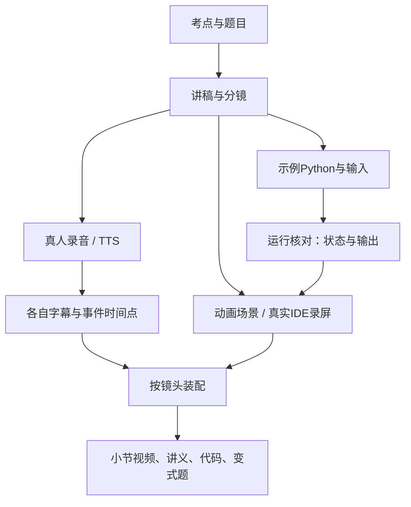

# 动画＋代码演示课程：架构建议

状态：研究提案，未实施、未性能测试、未冻结工具。以本项目需求作判断；没有找到可直接套用、同时满足中文过考教学、真人/TTS双版本与持续维护的现成仓库。

## 1. 设计围绕四个实际问题

1. 改一行Python代码，画面、执行结果和题目答案不能各改一份。
2. 重录一句口播，尽量只调整相关镜头的时间点。
3. 一位同学改讲稿，另一位改动画时，不争抢一个巨大工程文件。
4. 课程压缩时，可以移动或删减小节，保留来源和依赖，不重建全部材料。

因此采用 **每小节独立制作包＋共享视觉组件＋按音轨生成的时间轴＋按小节导出**。

## 2. 单节制作路径



每课前半段使用 Motion Canvas 解释概念，后半段由 AI 在真实 Python 环境自动输入、运行、修改及录屏，不要求用户手敲（用户 2026-09-28 最新要求；自动制作链尚未实施）。代码出现的速度不代表 Python 执行时间；代理自动输入需明确标注。

## 3. 工具选择

| 方案 | 与本项目的匹配 | 建议 |
|---|---|---|
| Motion Canvas＋真实录屏＋FFmpeg | Code组件能表现增删、选择和高亮；Time Events适合跟口播调整；适合容器、指针与代码联动 | **优先作为2分钟样片候选** |
| Remotion＋真实录屏 | React布局、按帧组合、多片段装配适合课程；细粒度代码变化需设计组件 | 备选；若首选在中文/导出/维护上失败，沿相同小节内容替换 |
| PowerPoint/Keynote＋录屏与剪辑 | 适合人工排版和快速概念动画 | 团队熟悉时可选；精确数据联动和双音轨维护需额外约定 |
| Manim | 数学图形和解释性动画成熟 | 本课主要矛盾是代码/列表/练习，当前无必要以其为主 |

判断依据来自 [来源R04–R12](../research/sources.md)，不是作者工具调查结果。优先Motion Canvas是因为新项目没有必须继承的React工程；本轮并未声称它已在本机跑通。**首片只用一个主要动画引擎，不先搭Motion Canvas＋Remotion双渲染链。**

OBS用于录制真正的操作片段；已有录屏素材也可直接进入。录屏源可以来自Windows桌面，但工程整理、脚本和导出在WSL2，不要求为录屏迁移整个开发环境。

## 4. 建议的后续文件结构

以下是实施时逐步创建的目录，当前实际文件以根README和进度为准。

```text
python-animation/
├── AGENTS.md / README.md
├── docs/                         # 跨小节需求、研究、制作说明
├── references/imported/          # 既有材料，只读底稿
├── course/
│   ├── catalog.yaml              # 小节顺序、目标、时长、前置、选学标记
│   └── lessons/list-filter/
│       ├── lesson.yaml           # 此小节素材与镜头入口
│       ├── script.md             # 口播、学生动作、事件ID
│       ├── storyboard.md         # 每镜头的画面、重点、字幕位置
│       ├── examples/             # 真实.py源与固定输入、预期输出
│       ├── exercises.md          # 题目、答案、讲评、变式
│       ├── media/                # 本小节录音、原始录屏及来源
│       └── timing/               # human / tts 独立时间点
├── studio/                       # 共用代码面板、列表、箭头、视觉参数及场景
├── tools/                        # 必要的代码核对、装配、媒体校验脚本
└── build/<lesson-id>/<variant>/   # 可重建的渲染、字幕、证据、交付
```

不为1～2位协作者先建数据库、API服务、在线编辑器、学生账号系统或多包工作区。实际小节出现时再建立对应目录；`docs` 不承担课程内容仓库。工具的package.json和锁文件放其实际包根目录，不强制为了目录好看而搬移。

## 5. 内容与时间的最小约定

| 数据 | 谁是正文 | 如何引用 |
|---|---|---|
| 课程顺序和课时 | catalog | 引用稳定lesson_id；调整顺序不重命名小节 |
| 代码 | examples中的.py | 画面读取文件及片段标记；不要在动画代码里再手抄一遍 |
| 输出/状态 | 固定输入下运行与核对结果 | 包含源码哈希、解释器版本、退出码、输出 |
| 讲解 | script.md | 口播段落和事件ID，例如condition-check、append-result |
| 事件时间点 | 每个音轨的timing文件 | 以小节内秒为源；渲染时明确换算帧和取整规则 |
| 视觉样式 | studio内共享参数 | 字号、留白、颜色集中改，不把像素规则写进每份讲稿 |

初期只需核验少量教学例子的关键状态，不先开发通用Python调试器。若用执行跟踪，必须定义记录发生在语句前还是语句后，并对可变对象保存快照，避免所有“历史列表”都变成终值。随机题固定种子和输入；画面状态要与同版本实际输出一致。

动画场景可以使用命名事件等待讲解到位；真人与TTS分别生成事件时间表。Motion Canvas原生时间事件可以作为编辑接口，但正式选择后应明确哪份文件是可编辑正文，避免YAML和场景元数据互相覆盖。

## 6. 更新与导出

- 修改代码：重核代码和答案，更新受影响画面，再渲对应小节。
- 修改录音：只重新对齐对应版本字幕/事件，再渲该版本；不得沿用旧语音时序。
- 修改共用字体/布局：复核受影响小节；按依赖决定重渲范围。
- 大纲压缩：改课程顺序/目标/时长，再检查前置知识，不机械加速视频凑时长。
- 录屏和动画先统一分辨率、帧率、音频格式再装配，输出每小节MP4及SRT。只有需要整套视频时再合并，不把全课作为最小返工单位。

## 7. 选型必须过的2分钟样片

样片需同时包含中文口播与代码、列表状态变化、一次代码编辑、真实操作衔接及一道填空题。验收中文字体与标点、代码缩进、关键状态、音画事件、30分钟扩展方式和WSL2导出可重复性。

不因工具知名或已有旧仓经验就宣布选型完成。首选能通过这些检查才锁定依赖；失败记录具体原因后切换备选，避免长时间比较而不产片。
