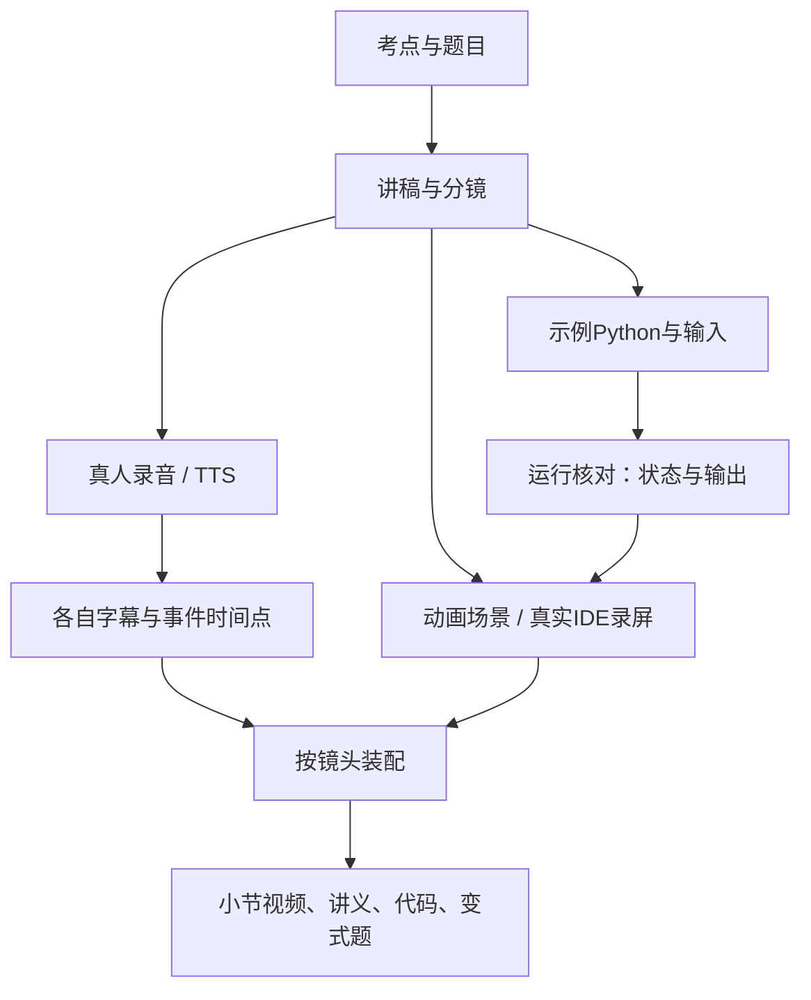

# 动画＋代码演示课程：架构建议

状态：全课程架构仍为提案，未完成整课、性能或跨机验收。2026-09-28 已按用户要求实施 Motion Canvas 宣传样片与 code-server＋Playwright 真实 IDE 样片，见[历史验证记录](../archive/project-status.md)。Motion Canvas 是当前用户要求，其他引擎仍为历史比较；共用规则以[根 AGENTS](../../AGENTS.md)为准，范围查[课程 README](../../course/README.md)和当前小节需求。本文按需查阅，不另设通用代码规范。

## 1. 设计围绕四个实际问题

1. 改一行Python代码，画面、执行结果和题目答案不能各改一份。
2. 重录一句口播，尽量只调整相关镜头的时间点。
3. 一位同学改讲稿，另一位改动画时，不争抢一个巨大工程文件。
4. 课程压缩时，可以移动或删减小节，保留来源和依赖，不重建全部材料。

因此建议全课程逐步采用 **每小节独立制作包＋共享视觉组件＋按音轨生成的时间轴＋按小节导出**；这不代表以下目录和接口已经全部实现。

## 2. 单节制作路径



每课前半段使用 Motion Canvas 解释概念，后半段由 AI 在真实 Python 环境自动输入、运行、修改及录屏，不要求用户手敲（用户 2026-09-28 要求；五行实操样片已实施，完整课程链尚未验收）。代码出现的速度不代表 Python 执行时间；代理自动输入需明确标注。30 秒宣传片按其独立任务全部使用 Motion Canvas。

## 3. 当前工具与历史比较

| 方案 | 与本项目的匹配 | 当前边界 |
|---|---|---|
| Motion Canvas＋真实录屏＋FFmpeg | Code组件能表现增删、选择和高亮；Time Events适合跟口播调整；适合容器、指针与代码联动 | 当前用户要求；样片已有实现，整课仍需验证 |
| Remotion＋真实录屏 | React布局、按帧组合、多片段装配适合课程；细粒度代码变化需设计组件 | 历史备选研究，不能直接替换当前引擎 |
| PowerPoint/Keynote＋录屏与剪辑 | 适合人工排版和快速概念动画 | 历史比较，精确数据联动和双音轨维护需额外约定 |
| Manim | 数学图形和解释性动画成熟 | 本课主要矛盾是代码/列表/练习，当前无必要以其为主 |

比较依据来自 [来源R04–R12](../research/sources.md)，不是作者工具调查结果。早期推荐 Motion Canvas 的理由是新项目没有必须继承的 React 工程；随后用户明确选择 Motion Canvas，并已有宣传样片实现。成员发现局限时记录证据，由项目负责人协调；只有用户新的明确决定可以改变当前引擎要求，不在个人分支自行替换。

当前真实 IDE 样片使用 code-server＋Playwright，四位成员的共用 Docker 样片入口见[工作台说明](../../docker/README.md)。OBS 与 Windows 桌面录屏保留为历史备选；具体任务采用时须明确真人/代理、输入和验收范围，不覆盖自动输入与真实执行要求。

## 4. 建议的后续文件结构

以下是实施时逐步创建的目录，当前实际文件以根README和进度为准。

```text
python-animation/
├── AGENTS.md / README.md
├── docs/                         # 跨小节需求、研究、制作说明
├── references/imported/          # 既有材料，只读底稿
├── course/
│   ├── catalog.yaml              # 小节顺序、目标、时长、前置、选学标记
│   └── lessons/list-filter/
│       ├── lesson.yaml           # 此小节素材与镜头入口
│       ├── script.md             # 口播、学生动作、事件ID
│       ├── storyboard.md         # 每镜头的画面、重点、字幕位置
│       ├── examples/             # 真实.py源与固定输入、预期输出
│       ├── exercises.md          # 题目、答案、讲评、变式
│       ├── media/                # 本小节录音、原始录屏及来源
│       └── timing/               # human / tts 独立时间点
├── studio/                       # 共用代码面板、列表、箭头、视觉参数及场景
├── tools/                        # 必要的代码核对、装配、媒体校验脚本
└── build/<lesson-id>/<variant>/   # 可重建的渲染、字幕、证据、交付
```

四人按负责人兼 DevOps、Canvas A、Canvas B、IDE 制作者分工，各用本机 WSL2＋Docker；修改范围与交叉审查见[四人工作流](../research/team-workflow-2026-10-01.md)。实际小节出现时再建立对应目录，不先建学生账号系统、学生网页 IDE 或完整课程平台；制作端 code-server 已有样片实现。工具的 package.json 和锁文件放实际包根目录。

## 5. 内容与时间的最小约定

| 数据 | 谁是正文 | 如何引用 |
|---|---|---|
| 当前课程范围与模块课时 | 根 AGENTS 指向的模块汇总大纲与当前需求 | 总计510分钟；旧 `course/catalog.md` 每课细纲暂保留，实际用到再处理 |
| 代码 | examples中的.py | 画面读取文件及片段标记；不要在动画代码里再手抄一遍 |
| 输出/状态 | 固定输入下运行与核对结果 | 包含源码哈希、解释器版本、退出码、输出 |
| 讲解 | script.md | 口播段落和事件ID，例如condition-check、append-result |
| 事件时间点 | 每个音轨的timing文件 | 以小节内秒为源；渲染时明确换算帧和取整规则 |
| 视觉样式 | studio内共享参数 | 字号、留白、颜色集中改，不把像素规则写进每份讲稿 |

初期只需核验少量教学例子的关键状态，不先开发通用Python调试器。若用执行跟踪，必须定义记录发生在语句前还是语句后，并对可变对象保存快照，避免所有“历史列表”都变成终值。随机题固定种子和输入；画面状态要与同版本实际输出一致。

动画场景可以使用命名事件等待讲解到位；真人与TTS分别生成事件时间表。Motion Canvas原生时间事件可以作为编辑接口，但正式选择后应明确哪份文件是可编辑正文，避免YAML和场景元数据互相覆盖。

## 6. 更新与导出

- 修改代码：重核代码和答案，更新受影响画面，再渲对应小节。
- 修改录音：只重新对齐对应版本字幕/事件，再渲该版本；不得沿用旧语音时序。
- 修改共用字体/布局：复核受影响小节；按依赖决定重渲范围。
- 大纲压缩：改课程顺序/目标/时长，再检查前置知识，不机械加速视频凑时长。
- 录屏和动画先统一分辨率、帧率、音频格式再装配，输出每小节MP4及SRT。只有需要整套视频时再合并，不把全课作为最小返工单位。

## 7. 历史2分钟验证建议与任务验收

早期建议约2分钟概念＋实操样片包含中文口播与代码、列表状态变化、一次代码编辑、真实操作衔接及一道填空题，用于检查中文字体与标点、代码缩进、关键状态、音画事件和整课扩展方式。这是可供任务选取的方案，不增加所有任务的固定内容或时长。

每项交付按任务正文检查规定区间；技术检查、真人审片、跨机复现分别记录。发现失败先保留复现证据和影响范围，修复当前要求下的链路；替换引擎仍须用户明确决定。现有小样片不证明全课程架构已通过。
