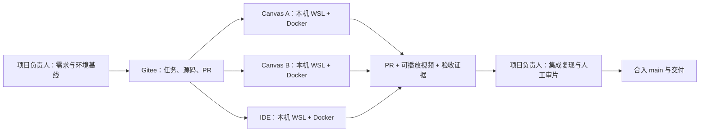

# 四人 WSL + Docker 课程制作工作流

日期：2026-10-01。状态：共用文档规则已统一；环境改造、镜像发布、共享存储和任务卡仍待实施，未发布线上任务。

本次已确认：四位真人，各自电脑、各自 WSL + Docker；项目负责人兼 DevOps，两人负责 Motion Canvas，一人负责真实 IDE 演示。每位成员可以使用自己的 AI 工具。Gitee 是主仓库，GitHub 如需使用仅作备份。

## 0. 四人共用的规则

- “项目负责人 / DevOps”指统筹需求、环境和合并的人；“任务执行者”指承担具体任务的一名成员；“审查人”指复核该任务的另一名成员。项目负责人承担开发任务时，同样记录输入、产物和验证，不免除共用规则。
- 用户最新明确要求优先；根 [AGENTS](../../AGENTS.md)规定共用规则，[课程 README](../../course/README.md)保存全课范围。本文与[任务模板](task-template-2026-10-01.md)提供协作方法，任务正文和模块说明不得扩大或覆盖产品约束。其他日期研究、导入 AGENTS 和旧样片便笺是资料。
- 当前课程按附件模块汇总，510 分钟。用户明确每课细纲暂时不改，等实际用到再处理；本轮保留 `course/catalog.md` 与附件细纲，不以旧34课安排派定全部课次。
- 每项任务写清执行者、修改范围、输入版本和适用验收；可使用完整 Issue、仓库任务文件或用户明确授权的聊天任务。未发布 Issue 不阻止已授权工作，AI 工具不是唯一记录入口。
- 每位执行者维护自己的任务证据；项目负责人维护共同目标、架构和衔接，从两组正文查看进度，不同步第三份项目 status。明确授权的文档整理任务可直接更新共用文档，保留已有工作；其他成员也可通过 PR 提交修改。
- 用户已明确两条制作线各有一份req/status，由制作成员编写；项目负责人维护共同目标、架构、接口和验收关系。当前成员与读取路径以[“列表”5分钟样片 README](../../course/lessons/list-5min/README.md)为准；文档未建立时由本组成员先创建，Issue/PR引用本组正文。
- 本文中的推荐拆分、命名、任务生命周期、并发数量、制作清单格式和四张任务卡是建议/草案，具体任务采用后执行。写入文档不代表相关工具能力或远端服务已存在。

## 1. 推荐的协作方式

推荐一个仓库、每人本地克隆、短任务分支、Gitee Issue 派工、PR 汇合、按任务验收。项目负责人维护课程需求与环境基线，执行者维护自己的交付证据。尚未发布 Issue 的授权任务先保存完整正文，发布后关联。AI 工具可以更换，任务与证据不依赖私人会话。

四人不需要共享一个可写工作目录，也不需要先引入 Kubernetes、复杂任务平台或多仓库拆分。当前首要交付是可复现的小样片和可靠制作链。

以上为目标工作方式，未代表已部署的任务系统。

## 2. 当前证据与判断

下表保留初次研究观察；本轮已对齐文档的条目标注修订结果。代码和环境观察是当时快照，不代替其他修复任务的最新验证。

| 已观察到的事实 | 对协作的影响 | 建议 |
|---|---|---|
| 初查 requirements 沿用旧建议和每课细纲，与根 AGENTS 的附件模块汇总510分钟不一致 | 接续任务可能选错范围 | 本轮已对齐需求；细纲原文暂不修改 |
| 初查 requirements 把一位同学的 `/home/yxsj98` 路径写成“本机” | 换机器或换工具就带入错误路径 | 本轮已改为各自实际路径，历史机器记录保留 |
| 旧 status 有多台机器的环境搭建、历史选型和产物记录；Git 索引中仍有该文件的未解决合并项 | 人人追加总状态会冲突，历史事实可能被当成当前状态 | 旧文件归档，执行者维护本组状态；本轮保留历史正文与已有索引状态 |
| Compose 的顶层 name、可变 local 镜像标签及输出位置固定；挂载来自 Compose 所在目录的父目录 | 单台机器切分支或开多个 AI 任务时，可能继续用旧容器、旧挂载、旧依赖卷 | 同机并行任务同时隔离 worktree、Compose 项目、端口和输出 |
| motion 固定运行 promo30；run-job 只接 demo/animation/all，分别指向旧样片 | 当前启动器不能当作任意新视频的通用生产接口 | 将支持 lesson/job 参数列为 DevOps 改造任务，现阶段按具体工程执行 |
| list-concat 的 prepare 与多个 record 脚本分别定义 workspace，部分指向 list-demo | 预备素材可能来自一个目录，录制却打开另一个目录 | 准备阶段输出同一份制作清单，录制阶段消费它 |
| 用户提供 PR #2 四项审查发现；本轮读到的脚本可对应源码插入、终端可见性、路径问题 | 教学源码/JS 语法通过无法证明真实录制成功 | 验收必须经过实际 IDE UI、保存、运行和录屏 |

本轮读取时，用户提到的 `docs/project/review-pr2-2026-10-01.md` 在本地仓库和 `/tmp/python-animation-pr2-review` 均未找到，因此没有声称读过完整审查证据或重现过四项问题。另一会话已有未提交修复与测试，本轮不覆盖。当前引用的是用户提供的审查结论和本地配置/源码检查。

本地依据：[AGENTS](../../AGENTS.md)、[归档前需求](../archive/project-requirements.md)、[历史状态](../archive/project-status.md)、[Compose](../../docker/compose.yaml)、[启动器](../../docker/course)、[任务运行器](../../docker/run-job.py)、[列表拼接制作脚本](../../studio/list-concat-demo/prepare_v2.py)。当前全课范围以课程 README为准。

## 3. 四个人怎样分工

| 角色 | 主要负责 | 交付物 | 复核与协作 |
|---|---|---|---|
| 项目负责人 / DevOps | 共同目标、任务输入、架构接口、环境与镜像基线、集成、最终发布 | 课程/小节 README、任务正文、可复现环境、集成视频与验收记录 | 验收教学内容、成片、约定的跨机复现；决定合并 |
| Canvas A | 一个小节的概念动画、分镜实现 | 场景源码、小节预览、关键画面与事件记录 | Canvas B 复核；读取同版教学代码 |
| Canvas B | 另一个小节的概念动画；可在具体任务中指定为共享组件维护者 | 场景源码或一个小型共享组件 PR | Canvas A 复核；共享组件变更说明影响范围 |
| IDE 制作者 | 教学源码、真实编辑/保存/运行自动化、录制与结果证据 | 可运行源码、实际保存文件、终端结果、录屏、验证记录 | Canvas 成员检查观感，项目负责人统筹复现 |

两位 Canvas 成员优先按不同小节并行。需要同一小节合作时，按独立场景文件拆分，并指定一人维护 project 入口与 `.meta` 时间事件文件，避免两人同时编辑同一时间轴。目录所有权是协作约定，不能替代代码审查。

当前列表样片明确由Soraya、余羿鸿共同完成同一段150秒动画；由两人决定具体场景分工和文档主维护人。王旭辉维护真实Python演示线。未来按不同小节并行的建议不覆盖本里程碑的明确人员安排。

IDE 成员准备的教学源码必须先明确版本。Canvas 成员读取同版源码或已验证状态数据，不在动画中另抄一套代码/输出。动画场景仍由人负责核对教学解释。

采用成员交叉审查；项目负责人统筹整体需求、集成复现与最终交付，不需要成为每个低风险 PR 的唯一技术审查者。常规实现按已授权范围推进，产品约束变更按用户明确决定更新。

## 4. 本地开发、Docker 与集成

### 每人一套本地环境

代码和绑定挂载数据保存在 WSL Linux 文件系统，例如各自的 `~/python-animation`；Windows 原材料只读导入。Docker 官方建议将绑定挂载来源放在 Linux 文件系统以改善性能和文件变更通知。[Docker WSL 最佳实践](https://docs.docker.com/desktop/features/wsl/best-practices/)

成员在各自电脑使用 9030/9042 不会互相抢占端口。只有同一台机器运行多套工程时才需要不同宿主端口。

DevOps 发布经过样片验证的镜像基线，优先使用不可变摘要，并保存 Dockerfile 与锁文件。镜像清单包含 Motion Canvas、Node、Python、code-server、Playwright、Chromium、FFmpeg 与字体版本。不要让四人各自随意更新依赖或用同名 `:local` 标签代表不同内容。

Playwright 官方要求容器环境与项目 Playwright 版本匹配，否则可能找不到浏览器；本项目现有锁定版本为 1.58.2，不因官方网页显示新版本就顺手升级。[Playwright Docker](https://playwright.dev/docs/docker)

源代码、字幕、制作清单与小型证据进 Git；视频、帧序列、大型素材优先放团队成员都能访问的交付位置，清单保存地址、SHA256 和取得方法；小型样片可按具体任务纳入 Git。共享位置尚待项目负责人选择并实测，不把某人的本机绝对路径当团队交付地址。已有“单文件超过100,000,000字节不上 Gitee”的限制继续适用；本轮不改 `.gitignore`，历史研究的提交矩阵不覆盖实际规则。

本机用户名、UID/GID、端口、代理、凭据留在本地环境配置。仓库只提供不含凭据的示例。不要把一个成员的 WSL 用户名或测试机地址写成课程需求。

### 同机多任务才使用 worktree 隔离

每个制作任务一个短分支；一个 Issue 可以由一个小 PR 完成。成员只有一个任务时，不强制增加 worktree。成员同时开多个任务/AI 会话时，每个会话使用自己的 worktree。[Git worktree](https://git-scm.com/docs/git-worktree)

worktree 只隔离源码目录，不会自动隔离 Docker。DevOps 的任务启动器应显式传 Compose 项目名，并将当前 worktree 挂载为 `/workspace`。motion/ide/worker 在同一任务内使用同一个源码与工作区；不同任务之间不能共享可写工作区或依赖卷。

Compose 的 `-p` 优先于顶层 `name:`，适合按任务隔离网络、容器和默认命名卷；固定宿主端口和共享可变镜像标签仍需另外处理。[Compose 项目名](https://docs.docker.com/compose/how-tos/project-name/)

建议命名：`pa-<成员代号>-<任务号>`。任务启动器应输出 worktree 路径、Git SHA、Docker context、Compose 项目名、挂载、端口和输出目录，启动前让成员看到自己实际在操作什么。实验镜像也用任务专属标签，不覆盖团队基线。

现有 `docker/course` 尚不支持上述全部任务参数。不要把这份建议中的命名方式当作已可用命令。

### 集成在项目负责人本机先做

制作/环境 PR 提交后，按任务验收范围在独立集成目录检出明确提交，使用相同镜像与锁文件，从干净输出目录复现；项目负责人统筹执行。文档任务核对语义、链接和差异即可。当前集成可先在项目负责人的 WSL + Docker 完成；任务要求跨机验证时由另一台实际机器验证，不用本机重复运行替代。

录制/渲染期间固定源码、音频、字体和时间轴版本。避免从仍被编辑的工作目录制作最终成片。产物按 `<lesson>/<variant>/<run-id>` 分目录，保留输入哈希。若允许未提交输入，清单必须记录补丁或快照，不能只记录 HEAD。

同一个可写 IDE 会话/小节输出目录一次只有一个制作任务。小内存主机先串行编码，实测 CPU、内存、耗时再增加并发。跨电脑无需共用本机锁；未来若有公共渲染机，任务队列和并发限制由该机器统一控制。

## 5. requirements 和 status 怎样重整

不要只换标题或再加长篇流水账。应让每类事实只有一个维护位置：

| 位置 | 保存什么 | 谁维护 |
|---|---|---|
| `AGENTS.md` | 入口、读写规则、可执行制作纪律与命令入口 | 项目负责人统筹，成员可提交变更；避免复制全部需求 |
| `course/README.md` | 全课范围、模块预算与制作入口 | 项目负责人维护，不复制组内详细需求 |
| 小节 README | 本里程碑共同目标、接口、成员和读取入口 | 项目负责人维护架构，两组引用 |
| 小节内 animation / python-demo 的 requirements与status | 两条制作线各自的详细需求、验收、实际进度和证据 | 对应制作成员创建并维护 |
| 任务正文（优先 Gitee Issue） | 执行者、修改范围、依赖及本组文档/证据链接 | 项目负责人派工；执行者更新，避免复制完整req/status |
| `course/lessons/<id>/` | 该小节的教学代码、讲稿、分镜与媒体引用 | 指定任务执行者 |
| `docs/production/` | 当前可复现制作操作与跨小节技术约定 | DevOps 与组件维护者 |
| 每次交付的 `manifest.json` / `verification.json` | 输入版本、实际检查、成片与证据链接 | 执行者生成；审查者复核 |
| 根 `README.md` | 项目介绍、两组文档路径和已有产物入口 | 项目负责人维护导航，不复制组内完整进度 |
| `docs/archive/`、`docs/project/context-updates.md` | 归档前需求、历史状态、环境事件与决定来源 | 历史正文保留；新决定追加到context-updates |

制作清单和验证记录的新增格式是建议，现有脚本尚未统一消费它们。当前里程碑的本组req/status是详细需求与制作状态的正文；Issue/PR链接它们，评论可说明本次变更或阻碍，但不另维护完整重复状态。旧项目req/status已归档，根 README只保留导航和已有产物概览。

需求建议使用稳定编号，每项只写一个可检验要求，保存来源和验收方式。例如：

| 编号示例 | 当前依据 | 如何验证 |
|---|---|---|
| REQ-COURSE-001 | 根 AGENTS 所指新大纲模块汇总，510分钟；不采用旧每课细纲 | 编排与新模块汇总逐项核对 |
| REQ-PRESENT-001 | 正式课前段 Motion Canvas，后段真实 Python，同例子衔接 | 审查分镜并连续播放完整小节 |
| REQ-IDE-001 | 自动输入/保存/运行；源码和真实输出正确 | 检查实际保存源码、退出码、UI结果和录像 |
| REQ-VARIANT-001 | 真人/TTS各有音频、字幕和时间轴 | 验证各自音轨与事件，不仅替换声音 |

这些编号只是拟议迁移形式，不表示本轮新增了课程要求。保留根 AGENTS 现有授权边界；不能把模型或引擎候选建议写成已批准。

课程产品需求、当前实现选择和本机配置要分开：中文清晰、状态正确、真实执行等属于验收；Motion Canvas 是用户明确的实现约束，换引擎须依据用户新的明确决定，由项目负责人更新需求与来源。AI 作者工具可以在同一任务约定下评估替换。

各组 status记录当前需求版本、最近实际交付、制作阶段、证据、阻碍和下一步；跨组汇报引用两组正文。不要把“healthy”“HTTP200”“编译通过”写成“视频已验收”。

建议任务流程为 `待领取 → 制作中 → 待审查 → 待项目负责人验收 → 完成`，阻碍单独标注原因和所需动作。可用 Issue 标签或现有任务功能记录，尚未部署看板。

完成按任务正文判断：范围内交付物存在、适用检查通过、约定复核与必要合入完成。文档、环境和视频任务选择各自检查，视频任务记录真人审片；任务制作已交付与最终验收/合入分别记录。每项写通过/失败/未执行，不让一个“已完成”覆盖全部状态。

建议每人同时制作的主任务先设为一个；待审查时可以评审同伴或准备下一任务。每周报告分别记录实际验收分钟数、环境/文档交付、阻碍和下周任务，避免以研究页数衡量课程产量。

## 6. 怎样发布任务

项目负责人在 Gitee 建 Issue，指定一名真人任务执行者，写清目标、输入版本、可修改范围、交付物、验收和依赖。尚未建 Issue 时使用完整任务文件或明确授权的聊天正文；执行者的 AI 会话是工具，不是团队唯一任务记录。文档整理不等于授权发布远端 Issue 或联系成员。

建议先下发可在一个工作日内完成和审查的小任务。时长只是拆分尺度，成员根据实际复杂度估计；不承诺所有视频任务一天完成。复杂任务拆成“环境可复现”“一个有效片段”“完整小节”，每个都有可检查结果。

任务有变更时，记录最新正文和简短来源，执行者读取同版要求；项目负责人统筹共用需求。用户在当前任务中明确的新要求可直接记录并继续执行，无需重复申请已有授权。跨成员通知由团队安排，AI 不因读到本段自动向他人发送消息。

可以直接使用配套的 [任务模板](task-template-2026-10-01.md)。成员把任务正文复制给任意 AI 工具，并明确仓库入口、当前分支和运行环境；工具不自动读取 AGENTS 时，在任务提示中显式要求读取。Codex 官方支持项目 AGENTS 指令和 worktree；其他工具的加载行为必须按各自实际能力核实。[Codex AGENTS](https://learn.chatgpt.com/docs/agent-configuration/agents-md)、[Codex worktree](https://learn.chatgpt.com/docs/environments/git-worktrees)

## 7. 可以马上发布的四张任务卡

以下是此前环境/制作链研究的待发布草案，没有向成员发送消息，也没有创建远端 Issue。当前“列表”5分钟样片按其README的范围、成员与阶段要求执行，这四张旧卡不自动纳入当前里程碑。

### DEV-01：项目负责人 / DevOps——建立团队可复现基线

目标：另一台成员电脑从指定提交和镜像基线启动后，可以完成同一小样片的制作验证。

输入：当前 Compose/Dockerfile/锁文件；一个实际验收通过的样片版本。尚未找到通过版本时，先标注未验证，不把 PR #2 当基线。

范围：环境说明、启动器、制作清单接口。与 IDE 任务执行者约定修改范围；同一文件不同时改。

交付：版本清单、无凭据配置示例、显式项目/端口/工作区启动能力、干净目录复现步骤、两台机器的验证记录。

验收：正确挂载任务源码；服务可用；实际渲染/录制并解码；产物输入版本可追溯；同机两套环境在需要时不互相影响。第二台机器验证由实际成员执行，不能用同一成员本机两次运行替代。

依赖：IDE修复可并行推进；发布基线需它通过或选用其他已通过的具体版本。

### IDE-01：IDE 制作者——修复并验证列表拼接真实录制链

目标：从全新输出目录完成三阶段真实编辑、保存、运行和录屏，源码与结果正确。

输入：PR #2 明确提交、三阶段教学源码与期望输出、现有四项审查；开始前先取得完整证据或重新复现，并读取共享提交/补丁及交付证据包。仅在用户明确要求同步时读取相关私人会话，不把私人聊天访问作为派工前提。

范围：`studio/list-concat-demo/` 录制准备与相关回归检查；依赖/Compose需要改动时与 DevOps 协调。

交付：一个确定入口、同一制作清单、每阶段保存源码/输出/退出码/截图、真实录像及最终片段、复现命令。多个 record 变体明确用途，避免入口含糊。

验收：首次运行自动创建必要目录；prepare 与 recorder 消费同一 workspace；阶段追加前显式将光标放在预期位置并核对磁盘源码；运行前确认终端可见且 cwd 正确；等待真实完成而非固定延时假定成功；三阶段 stdout 和退出码正确；录像实际呈现这些结果。失败应返回非零并保留故障画面，不能仅因 `tee` 成功而掩盖 Python 失败。

选择包含实际运行镜头的测试片段；现有 preview 只截前10秒，可能不含任何运行结果，不能作为这张任务卡的完整验收。

复核：Canvas成员检查可读性，项目负责人统筹干净集成环境复现。此任务指定一名执行者，不让两个AI会话同时修改同一录制文件。

### MC-01：Canvas A——制作与真实演示衔接的概念片段

目标：用同一交通工具列表情境解释创建两个列表、`+`、`+=`；每个变化与已验证代码状态一致。

输入：项目负责人确定的小样片长度/分镜、IDE已验证源码及哈希、明确音轨。输入未到位时可做布局草图，不能凭空冻结时间轴或输出。

范围：指定小节的动画场景与入口。不要同时改全课范围或全局Docker基线。

交付：场景源码、可播放动画片段、关键状态图、事件记录与复现方法。

验收：中文/代码清晰；动画状态和同版 Python 结果一致；与口播同步；结尾状态可衔接IDE；实际导出与完整解码。Canvas B连续审片，项目负责人复核教学解释。

Motion Canvas 的 Time Events 可让场景等待命名事件，便于调整口播时间；团队还需确定原生 `.meta` 和外部时间表谁是可编辑正文，避免双向覆盖。[Time Events](https://motion-canvas.io/docs/time-events/)

### MC-02：Canvas B——一个复用组件与独立验证片段

目标：先交付一个可复用列表可视化组件，使下一小节能够使用统一风格。

输入：项目负责人选定的参考画面/字号/颜色候选，以及MC-01所需列表状态；未批准样式明确写为候选。

范围：一个指定共享组件及独立验证场景；MC-01引用合入后的组件版本，避免两人争抢同一场景入口。

交付：组件代码、最小用例、实际渲染片段、已验证适用范围。不要先建设庞大组件库。

验收：创建/连接/追加的状态表现正确；字符串、长标签与字幕区域可读；MC-01接入后重新验证。Canvas A复核，项目负责人记录是否采用样式，不能包装为用户已批准。

完成组件任务后，Canvas B转入不同小节制作，与A按小节并行，而非长期只做基础设施。

## 8. AI 工具或模型变化时怎样接续

用户反馈 gpt-6.1-sol 在新视频制作上表现失效。本轮没有做模型对照实验；已有证据可以说明当前 PR 的录制链存在问题，无法单凭这些问题判定所有任务或整个模型都失效。

建议暂时把失败链路的修改限制为小任务，要求先真实复现、再交付一个通过的片段。执行者可以更换作者工具，但保留相同教学源码、音轨、容器版本和验收标准。

区分四层：AI模型、执行客户端/工具、制作脚本、视频引擎。先找出卡在哪层；客户端不能驱动浏览器与 Motion Canvas 无法表达动画是不同问题。换作者工具不必同时重做引擎和Docker。

建议由项目负责人安排固定30–60秒对照任务：中文、列表状态变化、真实IDE分阶段保存运行、字幕音画同步、第二台电脑复现。候选工具在独立分支、同样输入和时间预算下完成，记录实际成功率、人工修复时间、失败类型和费用；这是待实施评估，不是每位成员开始常规制作的新增前提。

换工具的交接包包含：完整任务正文、需求版本、Git SHA、分支、适用制作清单、已验证/失败检查、产物地址、下一步。会话链接可作背景，不能成为唯一上下文；凭据不进入交接包。

Codex 的 local environments 可以保存 worktree 初始化步骤和常用动作，但它是客户端便利配置；核心生产命令仍放仓库，使换客户端后也可执行。[Local environments](https://learn.chatgpt.com/docs/environments/local-environment)

如果连视频引擎也要换，先在研究任务中验证替代引擎；只有依据用户新的明确决定，项目负责人才能更新当前 Motion Canvas 约束。制作人员不自行在正式课分支中更换引擎。

## 9. 最小验收与证据

| 检查层次 | 能证明什么 | 不能代替什么 |
|---|---|---|
| 类型/语法检查 | 源码基本合法 | 可录制、画面正确 |
| 独立 Python 执行 | 固定输入下代码结果正确 | 视频中真实执行过 |
| 实际 IDE 自动化 | UI输入、磁盘保存、终端执行一致 | 成片声音/节奏已通过 |
| 实际渲染/编码及完整解码 | 导出媒体有效，参数符合任务 | 教学解释正确、人工审片 |
| 真人连续播放 | 可读性、教学解释、音画节奏 | 跨机可复现 |
| 干净环境复现 | 指定输入和环境可重制 | 所有课程都已完成 |

Motion Canvas允许导出指定帧区间，可用于快速验证修改；完整交付仍要导出并检查任务规定的全部区间。[Rendering](https://motion-canvas.io/docs/rendering/)

所有任务记录：任务ID/完整正文、Git SHA或输入快照、实际检查及结果、交付文件/地址、限制、审查人和日期。制作任务另记录适用的源码/音频哈希、镜像摘要/ID、解释器与浏览器版本、实际命令、媒体哈希和关键帧；无音轨、浏览器或视频的任务标不适用。局部证据明确写“仅此片段”，不扩大为整课通过。

## 10. 建议落地顺序与本轮结果

1. PR #2 在约定检查未通过前不标已验收；依据最新共享修复证据由项目负责人决定合并。当前索引冲突由正在负责合并的任务处理，本轮文档整理保留索引状态。
2. 当前先按列表样片README创建两组成员文档、约定同版输入与场景分工。DEV-01/IDE-01/MC-01/MC-02仅保留为可另行采用的旧草案，不据此替换本里程碑任务。
3. 第一份片段通过后，建立团队镜像和输入基线，做第二台成员电脑复现。
4. 本轮文档已形成可审查差异：当前需求归一、个人环境和历史记录边界标明、更新AGENTS读写规则；未迁移历史目录。后续按授权提交文档PR，由项目负责人合入。
5. 用同一对照片段评估需要替换的AI工具；有通过证据后再扩大课程任务。

本轮已完成：审查全仓 Markdown，统一四人共用的文档优先级、角色、维护与验收规则，补充可跨机器引用的大纲只读副本；每课细纲和既有代码修改保留。

尚未执行：PR #2修复或合并、Compose改造、镜像/共享存储发布、跨机复现、候选模型对照、远端Issue发布、提交或推送。旧项目req/status已归档，全课范围移入course README，成员日常不再读取旧总记录；Git 索引已有的未解决合并项未被暂存或标为解决。
